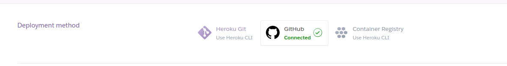
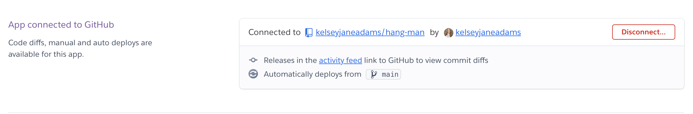
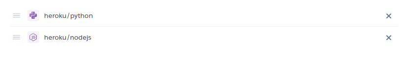

# Hangman


The link to [Hangman](https://hang-man-3-7f23d816fab2.herokuapp.com/).

The Hangman terminal game is an interactive word-guessing game designed for users to enjoy a fun and challenging experience. The primary purpose of the game is to engage players in a classic game of Hangman, where they must guess a hidden word one letter at a time. Players have a limited number of attempts to guess the correct word before the hangman figure is fully drawn, indicating a loss.

The game begins with the user selecting a difficulty level, which determines the complexity of the words they will need to guess. As they play, the game tracks their guesses, visually displays their progress, and provides feedback on correct and incorrect guesses. The user is also given the option to guess the entire word at any point in the game.

In addition to its entertainment value, the Hangman game serves as a secondary educational tool, helping users improve their vocabulary and spelling skills. By exposing players to a variety of words at different difficulty levels, the game subtly encourages learning and familiarization with English words.

Whether played for fun or as a light-hearted way to practice English, this Hangman terminal game offers both enjoyment and educational benefits to users.

## How to play:
1. Click this *[link](https://hang-man-3-7f23d816fab2.herokuapp.com/)*.
2. As soon as the page is loaded, click 'RUN PROGRAM'.
3. Choose a difficulty level: Easy, Medium, or Hard.
4. A word will be selected based on your chosen difficulty.
5. You have 7 attempts to guess the letters in the word.
6. Each correct letter guessed will be revealed in the word.
7. You can also attempt to guess the entire word at any time.
8. Each incorrect guess costs an attempt and draws part of the Hangman.
9. The game ends when you guess the word or run out of attempts.
10. Try to guess the word before the Hangman is complete. Have fun and Good luck!

## User Stories
### First Time Visitor Goals:
* As a first-time visitor, I want to understand how to play the Hangman game so that I can start enjoying the game without confusion.

* As a first-time visitor, I want to choose a difficulty level that matches my skill, so I can have a challenging but fair experience.

* As a first-time visitor, I want to see clear feedback on my guesses, so I know whether I’m getting closer to solving the word or not.

* As a first-time visitor, I want the game to display the hangman figure as I make incorrect guesses, so I can visually track how many attempts I have left.

* As a first-time visitor, I want to be able to guess the entire word if I think I know it, so I can win the game more quickly.

### Frequent Visitor Goals
* As a frequent visitor, I want to be able to quickly start a new game without going through lengthy instructions, so I can jump right into the action.

* As a frequent visitor, I want to challenge myself with higher difficulty levels, so I can test and improve my vocabulary and spelling skills.

* As a frequent visitor, I want the game to remember my preferences (such as difficulty level), so I can start playing according to my preferences without having to select them every time.

* As a frequent visitor, I want the game to offer a variety of words, so each session feels fresh and challenging.

* As a frequent visitor, I want the option to play again immediately after finishing a game, so I can enjoy multiple rounds without interruption.

## Features

Once the programme has loaded the user will be greeted with a welcome message and a main menu.


### Main Menu

The main menu is the first interface the user encounters when they start the game. It provides options to view the game instructions, start a new game, or exit the program.

The menu is displayed using a terminal menu interface, allowing users to navigate through options using the keyboard.

Users can select "How to Play" to view instructions, "Start Game" to begin a new game, or "Exit" to quit the application.


### Display Instructions

This feature provides clear instructions to first-time players on how to play the game.

When the user selects "How to Play" from the main menu, a detailed explanation of the game rules is printed. This includes how to select a difficulty level, how the game progresses with correct and incorrect guesses, and how the game ends.


### Select Difficulty

Allows the user to choose the level of challenge they want to face in the game.

After choosing to start a game, the user is prompted to select a difficulty level: Easy, Medium, or Hard.

Each difficulty level corresponds to a set of words with varying complexity, influencing how challenging the game will be.


### Display Word

Randomly selects a word from a pre-defined list based on the user’s chosen difficulty level.

After the user selects a difficulty level, the game selects a random word from the corresponding word list.

The chosen word is then prepared for the game, with its letters hidden from the user as underscores.

The game displays the word as a series of underscores, representing the hidden letters.


### Track User Input

This is the core of the Hangman game where the user interacts with the game by making guesses.

The user is prompted to guess letters one at a time or to guess the entire word.

The game tracks the user’s guesses, revealing correct letters in their positions and showing the hangman figure for incorrect guesses.

#### Correct Guess


#### Incorrect Guess 


### Visual Hangman

Provides a visual representation of the hangman figure as the user makes incorrect guesses.

For each incorrect guess, a part of the hangman figure is drawn, providing a visual cue of how many attempts remain.


The hangman figure progresses through the 7 different stages, becoming fully drawn when the user runs out of lives.


### Feedback on Guesses

Keeps the user informed about their progress in the game.

The game gives immediate feedback on each guess, telling the user whether the letter or word they guessed is correct or not.


If a letter has already been guessed, the game informs the user and prompts them to try again.


All feedback is clearly displayed in the terminal, with color-coding used to differentiate between correct and incorrect guesses.

### Display Guessed Letters

Helps users track which letters they have already guessed.

The game displays a list of letters that the user has guessed so far, preventing them from guessing the same letter twice.

This feature is especially useful as the game progresses and the list of guessed letters grows.


### End Game

Concludes the game and provides the user with their result.

If the user successfully guesses the word, a congratulatory message is displayed, and the user is informed that they have won.


If the user runs out of lives, a game-over message is displayed, revealing the correct word.


### Play Again Menu

Offers the user the option to start a new game or exit after a game has ended.

After the game ends, the user is presented with a menu asking if they would like to play again or exit.

If the user chooses to play again, the game restarts with a new word. If the user chooses to exit, the program terminates.


### Exit Game

If the user selects the "Exit" option from the main menu or the play-again menu, the game prints a farewell message and safely exits the application using sys.exit().


### Technologies Used

- [Python 3.8.5](https://www.python.org/downloads/release/python-385/): used to anchor the project and direct all application behavior

- [JavaScript](https://www.javascript.com/): used to provide the start script needed to run the Code Institute mock terminal in the browser

- [HTML](https://developer.mozilla.org/en-US/docs/Web/HTML) used to construct the elements involved in building the mock terminal in the browser

### Frameworks/Libraries, Programmes and Tools:
#### Python modules/packages:

##### Standard library imports:
- [random](https://docs.python.org/3/library/random.html) was used to implement random word generation.
- [srting](https://docs.python.org/3/library/string.html#module-string) was used to manipulate strings.
- [sys](https://docs.python.org/3/library/sys.html#sys.exit) was used to exit the terminal.

##### Third-party imports:
- [Simple Terminal Menu](https://pypi.org/project/simple-term-menu/) was used to implement the main, difficulty and exit menus.
- [Colorama](https://pypi.org/project/colorama/) was used to add colors and styles to the project.

#### Other tools:

- [VSCode](https://code.visualstudio.com/) was used as the main tool to write and edit code.
- [Git](https://git-scm.com/) was used for the version control of the website.
- [GitHub](https://github.com/) was used to host the code of the website.

### Bugs

**Solved Bugs**

1. The ```run_game(word)``` function was printing the hangman figure twice after each incorrect guess. The bug was resolved by removing redundant ```print(visual_hangman_lives[lives])``` statements in my code.

``` python
def run_game(word):
 
                    if not word_letters:
                        print(f"""
{Back.GREEN}You Win! The word was: {word}{Style.RESET_ALL}
""")
                        break
                else:
                    lives -= 1
                    print(f"""
{Fore.YELLOW}Sorry, {user_guess} is not in the word.{Style.RESET_ALL}
""")
                    print(visual_hangman_lives[lives])

        elif len(user_guess) == len(word) and user_guess.isalpha():
            if user_guess == word:
                print(f"""
{Back.GREEN}You Win! The word was: {word}{Style.RESET_ALL}
""")
                break
            else:
                lives -= 1
                print(f"""
{Fore.YELLOW}Sorry, "{user_guess}" is not the correct word.{Style.RESET_ALL}
""")
                print(visual_hangman_lives[lives])

```

2. The ```run_game(word)``` function was printing the invalid input message above the guess prompt instead of after it. To solve this bug I moved the invalid input message to print after the guess, and displayed it in red for better user feedback.

```python
        user_guess = input("Guess a letter or the full word: ").upper()

        if len(user_guess) == 1 and user_guess.isalpha():
            if user_guess in guessed_letters:
                print(f"""
{Fore.RED}You have already guessed the letter "{user_guess}".
Please try again.{Style.RESET_ALL}
""")
```

3. There was a text overflow bug with most of the print statements exceeding the terminal width, causing readability issues throughout my code. To solve this, I broke down long strings into multiple lines using triple quotes and string formattijng to fit within the terminal's character limit. 

Here is an example of how the new print statements look throughout the entire code.

```python
    if lives == 0:
        print(f"""
{Back.RED}{Fore.WHITE}You Lose! The correct word was: {word}{Style.RESET_ALL}
""")
```

## Testing

Please refer to the [TESTING.md](TESTING.md) file for all test related documentation.

## Deployment

- The program was deployed to [Heroku](https://dashboard.heroku.com).

### To deploy the project as an application that can be **run locally**:

*Note:*
  1. This project requires you to have Python installed on your local PC:
  - `sudo apt install python3`

  1. You will also need pip installed to allow the installation of modules the application uses.
  - `sudo apt install python3-pip`

Create a local copy of the GitHub repository by following one of the two processes below:

- Download ZIP file:
  1. Go to the [GitHub Repo page](https://github.com/kelseyjaneadams/hang-man.git).
  1. Click the Code button and download the ZIP file containing the project.
  1. Extract the ZIP file to a location on your PC.

- Clone the repository:
  1. Open a folder on your computer with the terminal.
  1. Run the following command
  - `git clone https://github.com/kelseyjaneadams/hang-man.git`

- Alternatively, if using Gitpod, you can click below to create your own workspace using this repository.

  [](https://gitpod.io/new/#https://github.com/kelseyjaneadams/hang-man)

  1. Install Python module dependencies:
     
      1. Navigate to the folder hang-man by executing the command:
      - `cd hang-man`
      1. Run the command pip install -r requirements.txt
        - `pip3 install -r requirements.txt`
      1. *Note:* If you are located in China  or any other country with restricted internet access, you may need to add the following code in order to be able to use the nltk package.
      
       - For example:

        ```python
        nltk.set_proxy('127.0.0.1:41091')
        ```
      - To set the proxy, you need to open setting in preferred VPN, find Server address and HTTP/HTTPS Proxy Port joining them by colons as it is shown in the example above:
      


### To deploy the project to Heroku so it can be run as a remote web application:
- Clone the repository:
  1. Open a folder on your computer with the terminal.
  1. Run the following command
  - `git clone https://github.com/kelseyjaneadams/hang-man.git`

  1. Create your own GitHub repository to host the code.
  1. Run the command `git remote set-url origin <Your GitHub Repo Path>` to set the remote repository location to your repository.

  1. Push the files to your repository with the following command:
  `git push`
  1. Create a Heroku account if you don't already have one here [Heroku](https://dashboard.heroku.com).
  1. Create a new Heroku application on the following page here [New Heroku App](https://dashboard.heroku.com/apps):

      - 

  1. Go to the Deploy tab:

      - 

      - 

  1. Link your GitHub account and connect the application to the repository you created.

      - 

  1. Go to the Settings tab:
  
      - 

  1. Click "Add buildpack":

      - 

  1. Add the Python and Node.js buildpacks in the following order:

      - 

  1. Click "Reveal Config Vars."

      - 

  1. Add 1 new Config Vars:
      - Key: PORT Value: 8000
      - *This Config was provided by [CODE INSTITUTE](https://codeinstitute.net/)*.

  1. Go back to the Deploy tab:

      - 

  1. Click "Deploy Branch":

      - 

      - Wait for the completion of the deployment.

      - 

  1. Click "Open app" to launch the application inside a web page.

      - 

## Credits

- Color formatting: [Colorama](https://pypi.org/project/colorama/).
- Terminal menu: [Simple Terminal Menu](https://pypi.org/project/simple-term-menu/).

## Acknowledgements

[Juliia Konn](https://github.com/IuliiaKonovalova)

I have deep grattitude towards my mentor Juliia Konn for her guidance and valuable feedback!

[Guheshwara](https://github.com/mwfelton)

I am very greatful to my husband for thoroughly testing my game.
