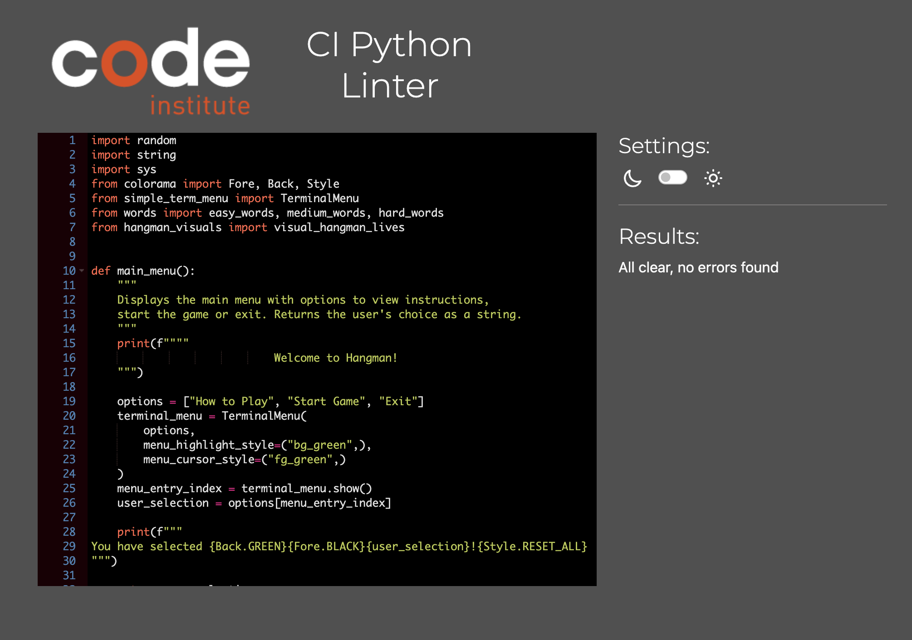
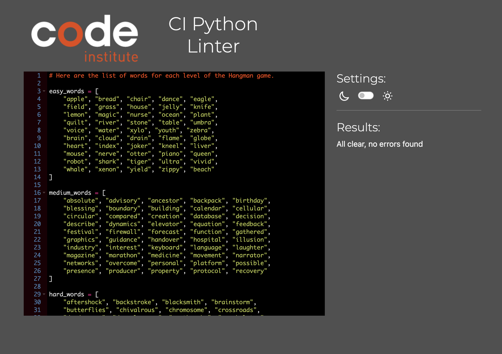
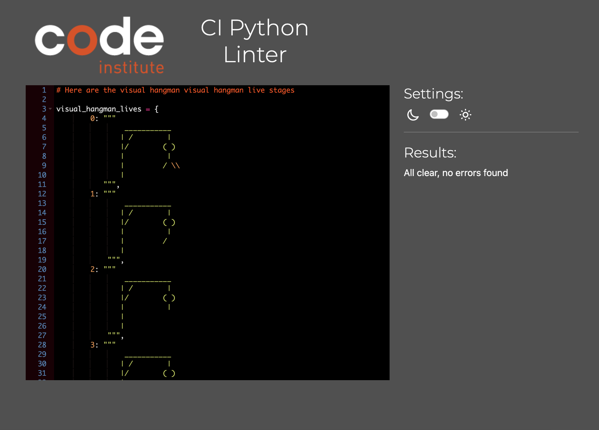
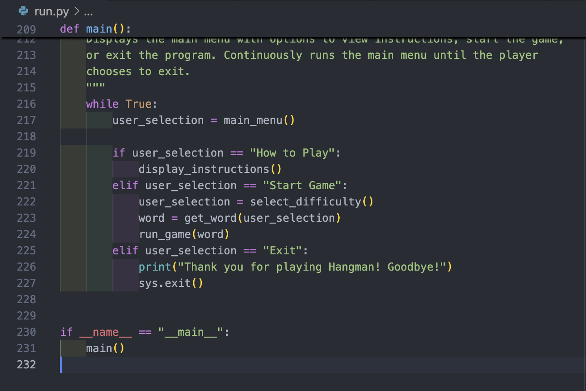
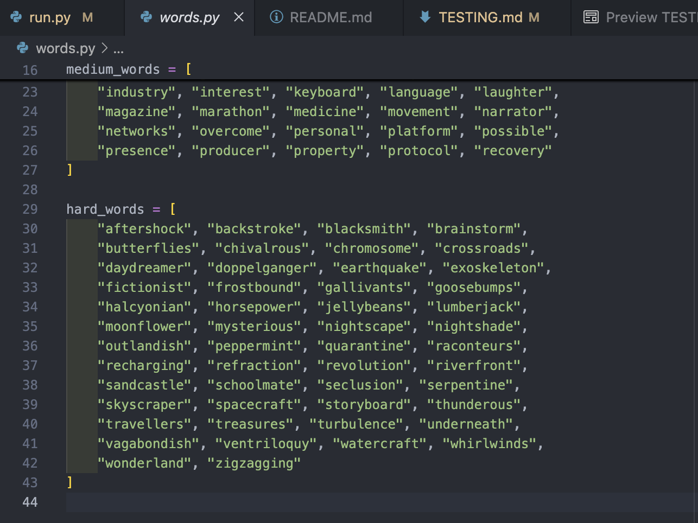
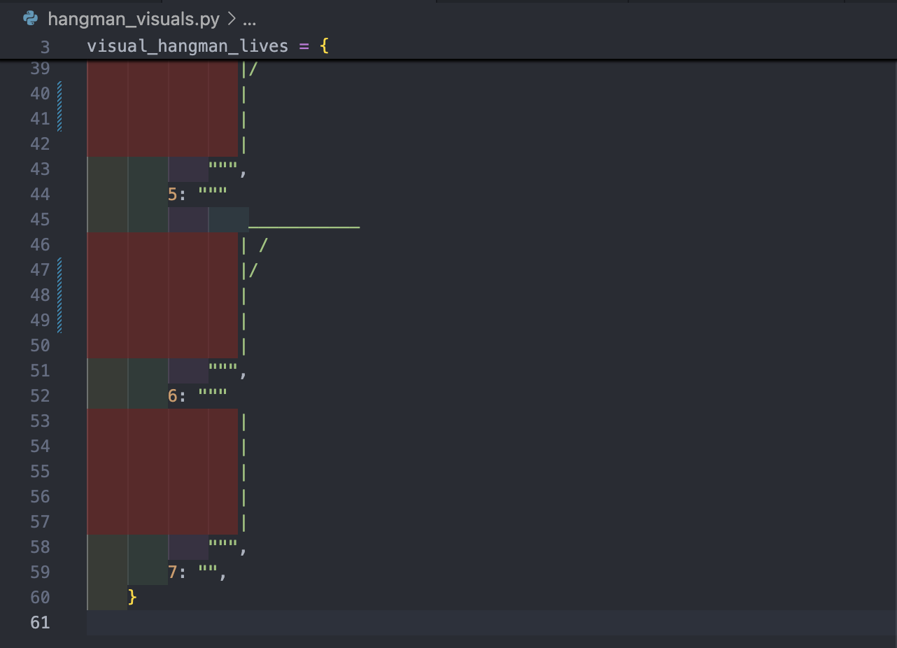

## Testing

The program was tested constantly during its development process.

Other users also tested it in order to spot possible grammatical mistakes that the code may present.

## Validators

Code Institute's CI Python linter was used to validate the code.

No errors were found:

- **run.py**

- **words.py**

- **hangman_visuals.py**

## Validating the Code

Since the validator may show that there is a missing line at the end of the code in some files
and that github does not show the last empty lines in all files, I will add the following
screenshots. These screenshots show that the code is structured according to PEP8 requirements
completely:

- **run.py**

- **words.py**

- **hangman_visuals.py**

